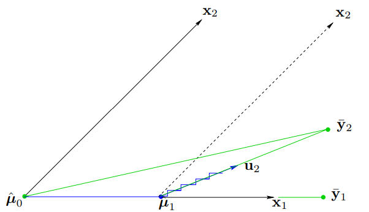
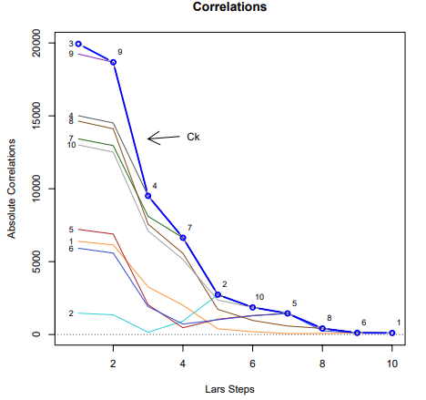

```{r setup, include=FALSE}
# This is the setup chunk
#  Here you can set global options for the entire document

library(knitr) # I recommend doing this here
library(ggplot2)
library(lars)
# Although you can call functions from a library using the following notation
#  without loading the entire library.
knitr::opts_chunk$set(echo = TRUE, 
                      comment = NA, # Required
                      fig.path = "./figures/",  # Store all figures here in relative path (make the folder first)
                      fig.align = "center",
                      fig.width = 7,
                      fig.height = 7,
                      message = FALSE, # Turn off load messages
                      warning = FALSE # Turn off warnings
                      )

```


## History of Lars

- LARS is a relatively new algorithm for fitting regressions to high-dimensional data
- Developed in 2004 by Stanford affiliates Bradley Efron, Trevor Hastie, Iain Johnstone and Robert Tibshirani
- Used as a less greedy and more efficient version of other model selection algorithms

## Core Concepts 
- LARS is considered a shrinkage method
  - Regression used to shrink high dimensional data and automatically select variables for model selection
- LARS is very similar to forward stepwise regression and forward stagewise regression
- Estimated parameters are increased in a direction equiangular to each predictor's correlation with the residual.

## Core Concepts 
-	LARS first standardizes all coefficients of a regression model to have a mean zero and unit norm
- Then, LARS selects the predictor with the largest correlation to the response variable.
-	LARS increases the coefficient of that predictor variable, starting from zero until it reaches its least-square value.

## Core Concepts 
-	Continues until another predictor variable has similar correlation with the calculated residual.
-	Add that next predictor variable to the model, then increase their coefficients in the direction of the joint least-squares coefficient until another predictor variable of similar correlation to their residual is found
-	This process repeats itself until the model reaches the full least-squares solution

## When and Why Use Lars

### Some other model selection methods

- Forward selection: starts with no variables in the model, and at each step it adds to the model the variable with the most explanatory power, stopping if the explanatory power falls below some threshold. 
  - This is a fast and simple method, but it can also be too greedy: we fully add variables at each step, so correlated predictors don't get much of a chance to be included in the model.
  - Example: Build a model for the deliciousness of a sandwich 
    - Variables: peanut butter and jelly

## When and Why Use Lars

### Some other model section methods

- Forward stagewise regression: tries to remedy the greediness of forward selection by only partially adding variables. Whereas forward selection finds the variable with the most explanatory power and goes all out in adding it to the model, forward stagewise finds the variable with the most explanatory power and updates its weight by only epsilon in the correct direction. 
  - The problem now is that we have to make tons of updates, so forward stagewise can be very inefficient.

## When and Why Use Lars

- LARS: Instead of making tiny hops in the direction of one variable at a time, LARS makes optimally-sized leaps in optimal directions. These directions are chosen to make equal angles/correlations with each of the variables currently in our model.
  - should be used when overfitting is a concern, or want to have sparse parameter values, or want your model to be easily interpretable 

## When and Why Use Lars

### Advantages of using Lars

1. Computationally as fast as forward selection but may sometimes be more accurate.
2. Numerically very efficient when the number of features is much larger than the number of data instances.
3. It can easily be modified to produce solutions for other estimators.

### Disadvntages of using Lars

- LARS is highly sensitive to noise and can produce unpredictable results sometimes.

## Mathematical Theory
- LARS is related to Forward Selection and based off of Forward Stagewise Regression. 
- Forward Selection, also known as "Forward Stepwise Regression," is an ambitious algorithm that creates a model by selecting the predictors most correlated to the response.

## Mathematical Theory

### Setting up the Problem

- As with the classic forward selection model, start with all coefficients $\beta_j=0;\ j\in[1,m];\ m=\text{number of predictors}$
- Find the predictor $x_j$ that has the highest correlation with $y$
- $\begin{cases}r > 0 & ;\ \text{increase } \beta _{j}\\r < 0 & ;\ \text{decrease } \beta _{j}\end{cases}$, and calculate residuals of the new model fit ($\hat{y}=\beta_jx;\ r=y-\hat{y}$)

## Mathematical Theory

### Estimating the First Coefficient

- Now that we have some residuals, we can calculate the correlation between the residuals and $x_j$, as well as the other predictors
- At each increment/decrement of $\beta_j$, we examine these correlations and only stop adjusting $\beta_j$ when we find some new predictor $x_k$ that has equal correlation with the residuals as $x_j$

## Mathematical Theory

### Fitting the Model

- Once we've found the competing predictor $x_k$, we increase $(\beta_j, \beta_k)$, but this time in their joint least squares direction, and continue until some new competing predictor has as much correlation with the residuals
<center>{width=50%}</center>
<center>[4] LARS Algorithm w/ m=2 Predictors</center>

## Mathematical Theory

### Optimizing the Solution

- For $m>3$, once we estimate the first two predictors, subsequent estimates with 3 or more predictors will fit the model along equiangular vectors
    - Since we are now dealing in higher-dimensional space, it's not as simple as taking the bisector of two vectors
- We stop adjusting the model when $< r,x_j>=0\forall j$

## Mathematical Theory

### Visualizing the Goal

- The end goal is to maximize the reduction of absolute correlations to the residuals at each step
<center>{width=40%}</center>
<center>[4] Correlations in LARS w/ m=10 Predictors</center>

----

Part 2

----

## Baby Example 1
```{r echo = TRUE}
#UsArrests Data from 1973
head(USArrests)
```

```{r echo = TRUE, warning = FALSE, error = FALSE, message = FALSE}
library(lars)
```


## Baby Example 1
```{r echo = TRUE, fig.width=6.5, fig.height=4.5}
#Matrix of predictors for lars function
X = model.matrix(USArrests$UrbanPop ~ ., data = USArrests)[,-1]
#Response variable
y = USArrests$UrbanPop
us.lars = lars(X,y,type="lar")
plot(us.lars)

```

## Baby Example 1
```{r echo = TRUE}
#Summary and coefficients of our lars fit
summary(us.lars)
```
```{r echo = TRUE}

coef(us.lars)
```


## Baby Example 2 - Using mtcars Data Set
```{r, error=FALSE, warning=FALSE, echo=TRUE}
head(mtcars, 5)

# Create the x matrix to be used in lars() function
car_x <- as.matrix(subset(mtcars, select=-c(mpg)))
head(car_x, 5)
```

```{r, include=FALSE}
attach(mtcars)
```

---
```{r, error=FALSE, warning=FALSE}
# Using lars function on mtcars dataset
car_lars <- lars(car_x, mtcars$mpg, type="lar", trace=TRUE, 
                 normalize=TRUE, intercept=TRUE)
```

```{r}
colnames(car_x)
```

---

```{r}
# Get summary of our mtcars lars object in the form of an ANOVA table
summary(car_lars)
```

---
```{r, fig.width=8, fig.height=6}
plot(car_lars)
```

```{r include=FALSE}
detach(mtcars)
```

---


## Example: Crime and Social Factors by DC Ward

Predict the number of crimes for each of Washington, DC's eight wards from a dataset of socioeconomic statistics.

**Predictors - ACS Social Characteristics DC Ward**  
US Census data on topics such as household types, relationship and marital status, school enrollment and educational attainment, languages spoken and immigration info. Sorted by Ward and provided by https://opendata.dc.gov.

**Response - Crimes Committed in the Past Two Years**  
Provided by the DC Metropolitian Police Department, hosted at https://dcatlas.dcgis.dc.gov.

## Example: Crime and Social Factors by DC Ward
This problem is perfect for LARS, since the number of predictors is much greater than the number of samples (153 vs 8) and multicollinearity is very high.
```{r}
# load the dataset for the predictors
social_data = read.csv("ACS_Social_Characteristics_DC_Ward.csv")

# order the dataset by ward 1-8 for convenience
x = social_data[order(social_data$WARD),]

# drop unneeded columns and convert to a matrix
x = as.matrix(subset(x, select = -c(OBJECTID, STATEFP, SLDUST, GEOID, NAMELSAD, LSAD,	LSY, MTFCC, FUNCSTAT, ALAND, AWATER, INTPTLAT, INTPTLON, NAME, WARD, GIS_ID,	SHAPEAREA, SHAPELEN)))
```

## Example: Crime and Social Factors by DC Ward
```{r}
# load the response data
social_data = read.csv("dc-crimes-search-results.csv")

# since the dataset is just a raw list of crimes, 
# calculate the total number of crimes for each ward
# and generate a new matrix from that information
y = as.matrix(data.frame(y=c(
  nrow(social_data[social_data$WARD == 1,]),
  nrow(social_data[social_data$WARD == 2,]),
  nrow(social_data[social_data$WARD == 3,]),
  nrow(social_data[social_data$WARD == 4,]),
  nrow(social_data[social_data$WARD == 5,]),
  nrow(social_data[social_data$WARD == 6,]),
  nrow(social_data[social_data$WARD == 7,]),
  nrow(social_data[social_data$WARD == 8,])
)))
```

## Example: Crime and Social Factors by DC Ward
```{r}
# fit the model
lars_fit = lars(x, y, type="lar", trace=TRUE)
```

## Example: Crime and Social Factors by DC Ward
We can consult the dataset to see what the variables shown in the other slide represent.

```
Males 15 years and over: Never married

Total households: Male householder, no spouse/partner present  

Total households: Male householder, no spouse/partner present: Householder living alone: 65 years and over  

Males 15 years and over  

Total households: Male householder, no spouse/partner present: With own children of the householder under 18 years  

Population 3 years and over enrolled in school: Elementary school (grades 1-8)  

Males 15 years and over: Divorced  
```

## Example: Crime and Social Factors by DC Ward
```{r}
# plot fitted values vs actual values to assess goodness
fitted_values = predict.lars(lars_fit, type="fit", x, s=2)$fit

ggplot(data=as.data.frame(y), aes(x=fitted_values, y=y)) + geom_point() +
  labs(x='Predicted Values', y='Actual Values', title='Predicted vs. Actual Values')
```

## Example: Crime and Social Factors by DC Ward
```{r}
plot(lars_fit)
```

## References
1. https://tibshirani.su.domains/ftp/lars.pdf
2. https://ir.library.louisville.edu/cgi/viewcontent.cgi?article=3487&context=etd
3. https://cran.r-project.org/web/packages/lars/lars.pdf
4. https://web.stanford.edu/~hastie/TALKS/bradfest.pdf

 

